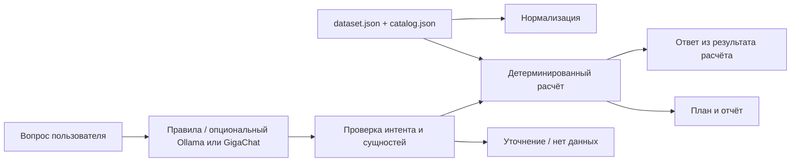

# SPA Inventory Assistant

Тестовое задание для AI / Data Science разработчика: нормализация складских
записей, детерминированный прогноз закупки и русскоязычный помощник.
Базовый режим работает **без API-ключей и без runtime-зависимостей**, на Python 3.11+.

Все исходные примеры перенесены из приложений PDF без изменения значений.
Три JSON-фрагмента Приложения 1 объединены в один валидный `dataset.json`:
`movements`, `history`, `questions`. Справочник находится в `catalog.json`.

## Быстрый запуск

Из корня репозитория:

```bash
python main.py
```

Будут созданы `RESULTS.md` и `artifacts/results.json`: восемь движений,
шесть прогнозов, пятнадцать исходных и пять дополнительных вопросов.
Время компьютера не используется: расчёт привязан к `as_of=2026-09-15`.

Полная проверка и измерение производительности — две команды:

```bash
python -m pip install -r requirements.txt
python main.py --verify --benchmark
```

При желании сначала создайте изолированное окружение:
`python -m venv .venv`, затем активируйте его обычным для вашей ОС способом.
В этой рабочей папке также подготовлен локальный интерпретатор:
`.tools\python\python.exe main.py --verify --benchmark`.
Он не входит в сдаваемый репозиторий и не нужен на машине с Python 3.11+.

Отдельные проверки:

```bash
python -m pytest -q
python -m ruff check .
python -m ruff format --check .
```

## Демонстрация

```bash
python main.py --serve
```

В этой рабочей папке Windows, если команда `python` не найдена, используйте
`& .\.tools\python\python.exe main.py --serve`.

Откройте **http://127.0.0.1:8000**. Выберите период и при необходимости лимит,
нажмите «Рассчитать план». Доступны таблица, объяснения, переключатель учёта
недатированных поставок и вопросы на русском языке. Сервер привязан к loopback,
завершается через Ctrl+C. Это однопользовательская демонстрация, не production-сервис.

Один вопрос из командной строки:

```bash
python main.py --question "Посчитай закупку скраба на полгода при лимите 200 тысяч"
```

Дополнительный режим LLM — локальный Ollama с уже загруженной моделью:

```bash
python main.py --question "Какой бюджет закупок на квартал?" --ollama-model YOUR_LOCAL_MODEL
```

Интеграция использует локальный `/api/chat`, JSON Schema, таймаут и fallback.
Модель получает только вопрос и классифицирует интент. Остатки, цены, расчёты
и текст числового ответа через модель не проходят. Сбой или некорректный JSON
автоматически возвращает разбор по правилам. Реальный inference модели в этой
среде не проверялся; таймаут, контракт и невалидные ответы проверены моками.

GigaChat Lite можно включить для командной строки и локальной веб-демонстрации.
Создайте ключ авторизации в [кабинете GigaChat API](https://developers.sber.ru/docs/ru/gigachat/api/reference/rest/gigachat-api)
и задайте переменную окружения перед запуском:

```powershell
$env:GIGACHAT_AUTH_KEY = "ваш_ключ_авторизации"
$env:GIGACHAT_SCOPE = "GIGACHAT_API_PERS" # или GIGACHAT_API_B2B / GIGACHAT_API_CORP
& .\.tools\python\python.exe main.py --serve
```

Перед запуском можно проверить API без вывода ключа или токена:
`& .\.tools\python\python.exe main.py --check-gigachat`.
Результат `GigaChat: ok` означает успешные OAuth и запрос к модели.
Код `oauth_http_401` обычно указывает на неверный ключ или scope; ошибка
`invalid_auth_key` указывает на неверный формат ключа; `*_connection_error`
указывает на проблему соединения. Коды `*_tls_error`,
`*_timeout`, `*_dns_error` отдельно показывают сертификат, таймаут и DNS.
По [документации GigaChat](https://developers.sber.ru/docs/ru/gigachat/certificates)
для API может понадобиться корневой сертификат Минцифры. Скачайте его с
официального портала Госуслуг и укажите путь к PEM/CRT файлу без отключения
проверки TLS:

```powershell
$env:GIGACHAT_CA_BUNDLE = "C:\путь\к\russian_trusted_root_ca_pem.crt"
& .\.tools\python\python.exe main.py --check-gigachat
```

В этой рабочей папке проверенный корневой сертификат уже лежит в
`.tools\certs\russian_trusted_root_ca_pem.crt` и подхватывается автоматически.
Его SHA-256 отпечаток DER: `d26d2d0231b7c39f92cc738512ba54103519e4405d68b5bd703e9788ca8ecf31`.
Папка `.tools` не входит в репозиторий; на другой машине скачайте сертификат
отдельно или установите его по инструкции Госуслуг.
Можно также запустить `& .\.tools\python\python.exe main.py --question "Сколько денег потребуется?"`.
Используется модель `GigaChat-2` (Lite), OAuth-токен обновляется автоматически.
В API отправляется только текст вопроса для определения типа задачи. При
настроенном ключе GigaChat оценивает интенты, если правила не обнаружили
явный конфликт задач; при ошибке API
используются локальные правила. Ключ и токен
остаются на сервере; браузер их не получает. При отсутствии ключа, ошибке сети
или невалидном ответе работает локальный разбор по правилам. Статус API и источник
разбора видны под ответом в веб-интерфейсе. Числа и текст расчёта формируются
приложением на основе данных склада; GigaChat определяет, какую задачу выполнить.
Подключение использует
обычную проверку TLS-сертификатов Python. Переменные окружения не сохраняйте в
репозитории. Если явно указан `--ollama-model`, используется локальный Ollama.

## Публичные функции

```python
import json
from spa_assistant import normalize_movement, forecast_demand, answer_question

with open("dataset.json", encoding="utf-8") as source:
    data = json.load(source)

movement = normalize_movement("05.03.2026 MS-01 приход OIL-001, 2 канистры по 5 л")
forecast = forecast_demand(data["history"], "OIL-001", 90, {})
parsed, confidence, answer = answer_question(
    "Сколько OIL-001 закупить на 90 дней?",
    {"history": data["history"]},
)
```

Эти функции также импортируются из `main` для удобства проверки.

Параметры прогноза:

| Параметр | По умолчанию | Значение |
| --- | --- | --- |
| `demand_multiplier` | `1` | Явный сценарий изменения расхода |
| `budget_limit` | `None` | Лимит в рублях; превышение показывается, потребность не скрывается |
| `credit_undated_incoming` | `True` | Условно считать поставки в пути доступными в течение горизонта |
| `product` | строка справочника по SKU | Полная строка другого каталога, если нужна интеграция |

`history.incoming_deliveries[sku]` может содержать `[{"date": "2026-09-20", "qty": 20}]`.
Сумма должна совпадать с `incoming_qty[sku]`. Поздние поставки не покрывают ранний
дефицит; даты поступления считаются началом дня. Без графика дата дефицита
рассчитывается без поставок, и это явно указано в ответе.

Контекст вопросов: обязательное поле `history`, опциональные `location_history`
(полная независимая история каждого объекта), `previous_params` (контекст
явного продолжения диалога, включая бюджет и сценарий), `llm_enabled=False`
(принудительно без сети), `ollama_model` (локальная LLM). GigaChat включается
через `GIGACHAT_AUTH_KEY` и необязательную `GIGACHAT_SCOPE`. Автоматического
соответствия MS-01 ↔ Сочи нет. Уточнение «масло» обязательно: в каталоге два масла.

## Архитектура



| Файл | Назначение |
| --- | --- |
| `spa_assistant/normalize.py` | Даты, SKU, количества, упаковки и операции |
| `spa_assistant/forecast.py` | Прогноз, запасы, календарь дефицита, закупка и бюджет |
| `spa_assistant/questions.py` | Интенты, сущности, уточнения и шаблон ответа |
| `spa_assistant/config.py` | Пороги и допущения |
| `spa_assistant/llm.py` | Опциональный локальный классификатор, без вычислений |
| `spa_assistant/evaluation.py` | Backtest и измерения скорости/памяти |
| `spa_assistant/report.py` | Воспроизводимый RESULTS.md и JSON-аудит |
| `spa_assistant/web.py` | Небольшой демонстрационный интерфейс |
| `tests/` | Эталонные расчёты и граничные случаи |

Деньги рассчитываются через `Decimal`; деление недельного расхода на дни,
границы упаковок и даты исчерпания — через точные `Fraction`. JSON отдаёт обычные
числа. Регулярные выражения переиспользуются, справочник читается один раз.
Для трёх коротких рядов Pandas, NumPy, ML-фреймворки, RAG и база данных добавили бы
зависимости без измеримой пользы. Состояние не изменяется, автоматически заказы
не размещаются. Контракты позволяют позднее добавить полноценный backend и БД.

## Результаты и границы

Подробности: [RESULTS.md](RESULTS.md), [методология](docs/METHODS.md),
[структура данных](docs/DATA_MODEL.md), [матрица требований](docs/REQUIREMENTS.md).

Техническое тестовое из трёх частей реализовано. Бизнес-документ описывает более
широкий будущий продукт: в исходном наборе нет сроков годности, партийных остатков,
истории цен, поставщиков, загрузки, себестоимости услуг и разбивки по объектам.
Эти сведения не синтезируются под видом исходных данных. Помощник объясняет, что
нужно добавить. Отчёт не заявляет достижение продуктовых KPI или приёмку заказчиком.

В данных только 12 недель. Прогноз на год является сценарием постоянного уровня
спроса и цен, а не доказанной точной годовой моделью. `confidence` — прозрачная
эвристика качества, не вероятность и не доверительный интервал.

Ответы о мотивации кандидата: [MOTIVATION.md](MOTIVATION.md). Перед отправкой
нужно заполнить личные сведения, создать публичный GitHub/GitLab-репозиторий
и поместить ссылку в раздел «О себе» резюме, как требует задание.
Публикация репозитория и отправка резюме не выполнялись.
