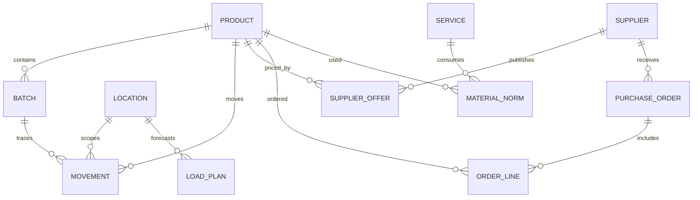

# Структура и происхождение данных

## Реализованный контракт

| Сущность | Ключ / поля | Правила |
| --- | --- | --- |
| Товар | `sku`, `name`, `unit` | Уникальный SKU, базовая единица л/кг/пар/шт |
| Условия поставки | `pack_size`, `min_order_qty`, `lead_time_days`, `price` | Цена за базовую единицу, одна строка условий на SKU |
| Политика запаса | `safety_stock_days` | Число дней текущего спроса |
| Движение, сырой пример | `id`, `text` | Только проверка нормализатора |
| Нормализованное движение | `date`, `sku`, `location`, `operation`, `qty`, `unit`, `batch`, `doc_no` | Неизвестное значение — `None`; без автоматической проводки |
| Недельная история | `weekly_consumption[sku]` | От старой недели к новой, `null` — нет наблюдения |
| Снимок остатков | `as_of`, `current_stock[sku]` | Начало дня снимка, без повторного применения движений |
| Поставки в пути | `incoming_qty[sku]` | Совокупный подтверждённый объём; дата в приложении отсутствует |
| Опциональный график | `incoming_deliveries[sku] = [{date, qty}]` | Поступление в начале даты; сумма равна объёму в пути |
| Опциональный объект | `context.location_history[location]` | Полный отдельный `history`, без смешивания с общим складом |
| Расчёт | SKU + `as_of` + горизонт + параметры | Воспроизводимый результат, формулы, допущения и признаки риска |

`dataset.json` объединяет три фрагмента приложения под ключами `movements`,
`history`, `questions`. Значения фрагментов сохранены. `catalog.json` содержит
ровно шесть строк приложения. JSON-ответы сериализуемы с `allow_nan=False`.
`artifacts/results.json` хранит исходные параметры, полные результаты и SHA-256
обоих входных файлов; это демонстрационный журнал расчёта, не бухгалтерский регистр.

## Расширение для полного бизнес-продукта

Требуемые, но отсутствующие в тестовом данные и связи:

Партийный FEFO требует `batch_id`, даты истечения и остатка партии; ценовая
динамика — поставщика, даты действия и исторических цен; себестоимость услуги —
норм материалов и цены услуги; помесячный план — графика поступлений и
непрерывного переноса остатков, а не трёх независимых прогнозов по 30 дней.
Снимок, движения и заказы должны сверяться на один момент времени.

Для production нужны неизменяемые снимки, контроль единиц и направлений возврата,
идемпотентность импорта, фиксация версии политики расчёта и отдельная приёмка
качества данных. Эти сущности описывают расширение, не выданы за реализованную БД.
